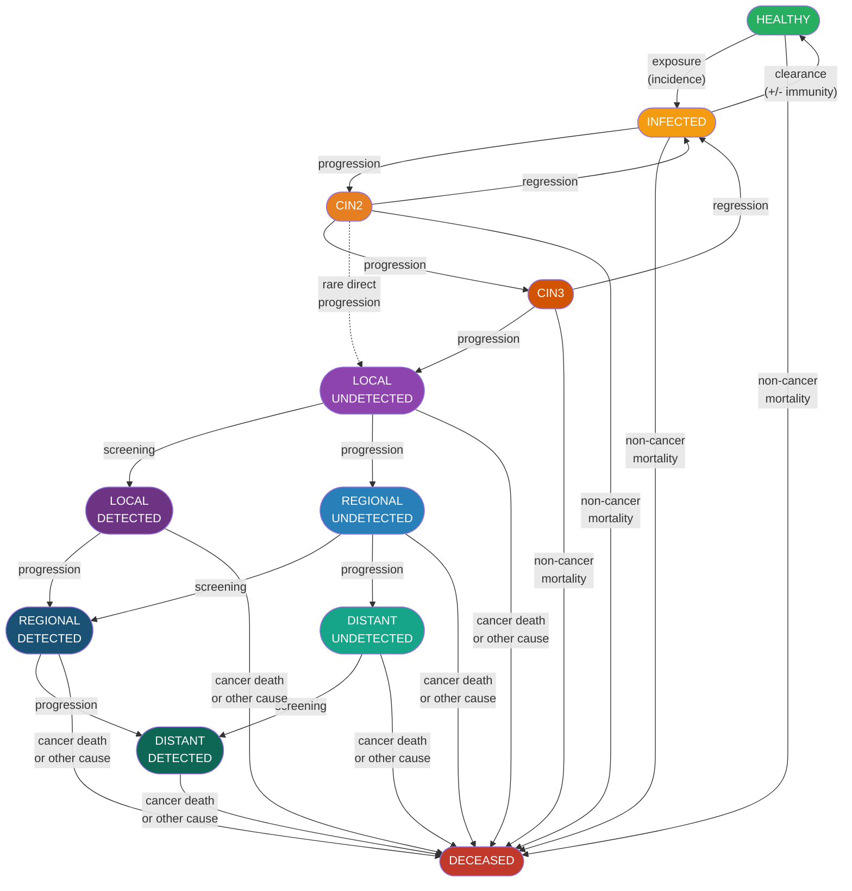
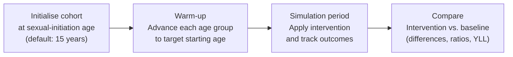

# Model description

This document explains the theoretical basis of the HPV Progression Model, describes each health state and transition, and lists the epidemiological sources behind every parameter.

---

## Conceptual framework

The model treats the clinical progression of an HPV infection as a **semi-Markov process**. At every monthly time step, each simulated individual occupies exactly one of eleven mutually exclusive health states. The probability of transitioning to another state depends on:

- the **current state**,
- the **time already spent in that state** (the "semi-Markovian" property — unlike a plain Markov model, sojourn time matters), and
- the **HPV genotype** driving the infection (for pre-cancer and cancer transitions).

The simulation is **stochastic**: each monthly transition is drawn from a multinomial distribution. Running the same cohort twice will yield slightly different outcomes, although the global random-number generator is seeded for reproducibility (seed = 42 by default).

---

## Health states

| # | State | Description |
|---|---|---|
| 0 | `HEALTHY` | No active HPV infection. |
| 1 | `INFECTED` | Active HPV infection, no high-grade lesion (includes CIN 1 / ASCUS). |
| 2 | `CIN2` | Cervical intraepithelial neoplasia grade 2 — a precancerous lesion that can regress spontaneously or progress to CIN3. Treatable in an outpatient setting. |
| 3 | `CIN3` | CIN grade 3 — rarely regresses on its own; can progress to invasive cancer. Usually treated in a hospital setting. |
| 4 | `LOCAL_UNDETECTED` | Invasive cervical cancer confined to the cervix, not yet diagnosed. |
| 5 | `LOCAL_DETECTED` | Invasive cervical cancer confined to the cervix, clinically diagnosed. |
| 6 | `REGIONAL_UNDETECTED` | Cancer spread to nearby lymph nodes or pelvic tissues, undetected. |
| 7 | `REGIONAL_DETECTED` | Same, diagnosed. |
| 8 | `DISTANT_UNDETECTED` | Cancer metastasised to distant organs, undetected. |
| 9 | `DISTANT_DETECTED` | Same, diagnosed. |
| 10 | `DECEASED` | Death (from cervical cancer or any other cause). |

The detected/undetected split for cancer stages mirrors the FIGO classification:

| FIGO stages | Model state |
|---|---|
| I | Local |
| II–III | Regional |
| IV | Distant |

---

## State-transition diagram



> **Dashed arrow** (CIN2 → LOCAL_UNDETECTED): direct progression from CIN2 to invasive cancer is rare but possible according to the Kim et al. (2017) parameter set.

---

## Infection and genotype

The model tracks nine HPV genotypes:

| Enum value | Genotype | Risk class |
|---|---|---|
| `HPV_16` | HPV 16 | High-risk (most oncogenic) |
| `HPV_18` | HPV 18 | High-risk |
| `HPV_31` | HPV 31 | High-risk |
| `HPV_33` | HPV 33 | High-risk |
| `HPV_45` | HPV 45 | High-risk |
| `HPV_52` | HPV 52 | High-risk |
| `HPV_58` | HPV 58 | High-risk |
| `OTHER_HR` | Other high-risk types | High-risk |
| `OTHER_LR` | Other low-risk types | Low-risk |

An individual can harbour multiple concurrent infections (one `HPVInfection` object per genotype). The individual's aggregate health state is the most severe state across all active infections.

### New exposures

New infections are introduced at each time step by sampling from an **age-specific incidence curve** (from Muñoz et al., 2004) scaled by **genotype-specific prevalences** (from Wendland et al., 2020 and Bandeira et al., 2024). An individual cannot acquire a genotype they are currently immune to.

### Clearance and natural immunity

When an infection transitions back to `HEALTHY`, there is a 50% probability that the individual acquires **natural immunity** against that genotype and cannot be reinfected with it later.

---

## Transition probabilities

Monthly transition probabilities are stored in a 3-D NumPy array with shape:

```
(time_in_state, from_state, to_state)
```

indexed per genotype. They are loaded from [`seed/natural_history_params.yaml`](../seed/natural_history_params.yaml), which was derived from **Kim et al. (2017)**, supplementary eTable 1. Where the original paper gives a range (min, max), the model uses the midpoint.

Because each row must sum to 1, the probability of remaining in the current state is `1 − Σ(transition probabilities to other states)`.

---

## Mortality

Two sources of death are modelled simultaneously:

1. **Non-cancer (all-cause) mortality** — an age-specific monthly probability applied to all individuals at every time step, loaded from GBD 2021 data for Brazilian females.
2. **Cancer-related excess mortality** — additional mortality applied to individuals in cancer states, derived by converting FIGO-stage survival curves (Carmo & Luiz, 2011) into monthly hazard increments on top of background mortality.

Years of Life Lost (YLL) are computed using the GBD 2021 reference life table (life expectancy at age of death).

---

## Screening

Screening is modelled via a `ScreeningRegimen`, which defines:

- **Eligibility**: minimum age and recommended inter-screening interval (in months).
- **Method**: a `ScreeningMethod` object with state-specific sensitivities and an overall specificity.

The built-in regimen, `PAP_SMEAR_3YRS_25_64`, implements the Brazilian national guideline: Pap smear every 3 years for women aged 25–64.

### Pap smear test characteristics

| State | Sensitivity |
|---|---|
| CIN2 | ~27 % |
| CIN3 | ~41 % |
| Local cancer | ~60 % |
| Regional/distant cancer | ~60 % |
| Healthy / Infected | — (false positive rate = 1 − specificity ≈ 14 %) |

### Compliance

Compliance is heterogeneous across the population. The model fits a **log-normal distribution** to a target cumulative compliance rate at the recommended interval, then draws individual compliance thresholds. At each time step, a woman is screened if the elapsed time since her last screening exceeds her personal threshold.

### Effect of a positive screen

- If the detected condition is `CIN2` or `CIN3`, the `see_and_treat_lesions()` method removes the lesion (resetting the state to `HEALTHY` or `INFECTED` depending on remaining infections).
- If the detected condition is an undetected cancer, the state transitions to its detected counterpart (e.g. `LOCAL_UNDETECTED` → `LOCAL_DETECTED`). Detected cancers carry lower excess mortality than undetected ones, reflecting earlier treatment.

---

## Vaccination

The model supports **quadrivalent vaccine** administration via `Individual.vaccinate_quadrivalent()`. Effectiveness by genotype:

| Genotype | Effectiveness |
|---|---|
| HPV 16 | 54 % (conservative estimate reflecting real-world coverage) |
| HPV 18 | 54 % |
| HPV 31 / 45 (cross-protection) | partial |
| Others | 0 % |

Vaccination does not affect existing infections; it only modifies the probability of acquiring the targeted genotypes in the future.

---

## Outcomes tracked

The `ObservableOutcome` enum lists all countable events accumulated at each monthly time step:

| Outcome | Description |
|---|---|
| `SCREENINGS` | Cervical cancer screenings performed |
| `COLPOSCOPIES` | Colposcopy procedures |
| `CIN2_DETECTIONS` | CIN2 lesions detected |
| `CIN3_DETECTIONS` | CIN3 lesions detected |
| `EXCISIONS_TYPES_1_2` | Loop excisions (LLETZ type 1–2) |
| `EXCISIONS_TYPE_3` | Loop excisions (LLETZ type 3) |
| `BIOPSIES` | Biopsies performed |
| `CANCER_CASES` | New invasive cancer cases |
| `LOCAL_DETECTIONS` | Invasive cancers detected at local stage |
| `REGIONAL_DETECTIONS` | Invasive cancers detected at regional stage |
| `DISTANT_DETECTIONS` | Invasive cancers detected at distant stage |
| `DEATHS_CANCER` | Deaths from cervical cancer |
| `DEATHS` | Deaths from all causes |
| `YLL_CANCER` | Years of Life Lost from cervical cancer |
| `YLL` | Years of Life Lost from all causes |

Outcomes are stored both as **nominal counts** and as **time-discounted counts** (default discount rate: 4.3 %/year, from Rethink Priorities, 2023).

---

## Cohort initialisation

The typical analysis workflow follows three phases:



1. **Initialise** — create one `Individual` per member of each age bucket, all starting at the average age of sexual initiation (15 years in Brazil).
2. **Warm-up** — advance each age group month by month until it reaches the target age, accumulating HPV infections and natural history events. This ensures the cohort has a realistic prevalence distribution at the start of the analysis.
3. **Simulation** — run the cohort with and without the intervention for the desired follow-up period, recording outcomes at each step.
4. **Compare** — use `evaluate_intervention()` or `compare_differences_in_outcomes()` to compute absolute differences, risk ratios, and discounted YLL differences.

---

## Data sources

| Parameter set | Source |
|---|---|
| State-transition probabilities | Kim, J.J. et al. (2017). *JAMA Oncology*, 3(6), 809-816. [doi:10.1001/jama.2017.19872](https://doi.org/10.1001/jama.2017.19872) |
| Age-specific incidence curve | Muñoz, N. et al. (2004). *New England Journal of Medicine*, 350(11), 1133-1140. [doi:10.1056/NEJMoa031444](https://doi.org/10.1056/NEJMoa031444) |
| HPV genotype prevalence (Brazil) | Wendland, E.M. et al. (2020). *Scientific Reports*, 10, 4920. [doi:10.1038/s41598-020-61582-2](https://doi.org/10.1038/s41598-020-61582-2); Bandeira, I.C.J. et al. (2024). *PLOS ONE*, 19(6), e0305122. [doi:10.1371/journal.pone.0305122](https://doi.org/10.1371/journal.pone.0305122) |
| Cervical cancer survival curves | Carmo, C.C. & Luiz, R.R. (2011). *Revista de Saúde Pública*, 45(4), 661-667. [doi:10.1590/S0034-89102011005000029](https://doi.org/10.1590/S0034-89102011005000029) |
| All-cause mortality & life expectancy | Global Burden of Disease Study 2021, Brazilian females. [GBD Results Tool](https://vizhub.healthdata.org/gbd-results) |
| Screening coverage (Brazil) | IBGE. Pesquisa Nacional de Saúde 2019 (DHS). |
| Discount rate | Rethink Priorities (2023). A review of GiveWell's discount rate. |
